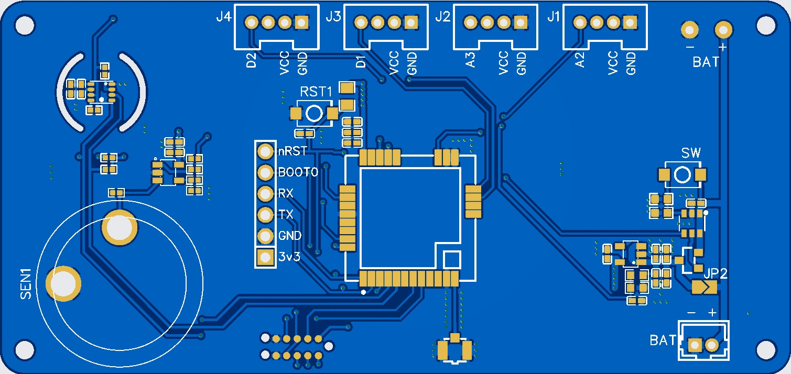

# RAK3172 LoRa Sensor Node (O2 + BME280 + Battery)

Complete en opschone GitHub-structuur voor een custom RAK3172 (STM32WLE5) sensorboard.

Deze repository bevat:
- Productie-sketch voor LoRaWAN uplink met 8-byte binaire payload.
- Hardware-overzicht op basis van PCB-topview en schema.
- UART boot/upload werkwijze zonder ST-Link.
- Referentiedocumentatie voor bring-up en Node-RED routing.

## Inhoud

- [Overzicht](#overzicht)
- [Repository-structuur](#repository-structuur)
- [Hardware en aansluitingen](#hardware-en-aansluitingen)
- [Firmwareconfiguratie](#firmwareconfiguratie)
- [Build en upload (Arduino CLI)](#build-en-upload-arduino-cli)
- [LoRaWAN payload-formaat](#lorawan-payload-formaat)
- [Node-RED / MQTT integratie](#node-red--mqtt-integratie)
- [Documentatie](#documentatie)
- [Roadmap](#roadmap)

## Overzicht

Doel van deze node:
- O2, temperatuur, luchtvochtigheid en batterijstatus periodiek verzenden via LoRaWAN.
- Vast 8-byte payloadcontract voor stabiele backend-routing.
- Betrouwbare UART-flashprocedure via BOOT0 + nRST.

Laatste bevestigde runtime:
- Uplink ontvangen op topic:
  `loranet/application/Cupm_LoRaWan_506/device/ac1f09fffe1da1d1/rx`
- Voorbeeld payload (base64): `AW0A/gDLAWQ=`

## Repository-structuur

```text
.
├── RAK3172_Binaire_payload_rui.ino
├── arduino_secrets.h
├── arduino_secrets.example.h
├── .vscode/
└── docs/
    ├── images/
    │   └── pcb-top-view.jpg
    ├── hardware/
    │   └── Schematic_Aalfredkievit_1_v4_2025-12-30.pdf
    ├── guides/
    │   ├── RAK3172_Bringup_Handleiding_Uitgebreid.pdf
    │   ├── RAK3172_Upload_UART_Handleiding.pdf
    │   └── RAK3172_NodeRED_Bijlage_PayloadRouting.pdf
    └── legacy/
        └── README_VSCODE.md
```

## Hardware en aansluitingen



Gebaseerd op schema en handleidingen:

- Module: `RAK3172-8-SM-NI` (STM32WLE5).
- Programmeren: STM32 system bootloader via UART.
- Belangrijke header-signalen: `nRST`, `BOOT0`, `UART_RX`, `UART_TX`, `GND`, `3v3`.
- Sensorconnectoren bovenrand: `J1..J4` met labels `A2`, `A3`, `D1`, `D2`, plus `VCC`/`GND`.
- Battery rails aanwezig (`BAT+`, `BAT-`).

### UART converter (TRU COMPONENTS TC-9260976)

Aanbevolen verbinding (3.3V logic):
- `X2 TXD 3.3V` -> `RAK UART2_RX (PA3)`
- `X3 RXD` -> `RAK UART2_TX (PA2)`
- `X5 GND` -> `RAK GND`
- `X1` -> `GND` (vastleggen als 5V-driver niet gebruikt wordt)

Niet aansluiten op modulelogic:
- `X4 TXD 5V`
- `X6 VBUS 5V`

## Firmwareconfiguratie

Actuele productiesketch: `RAK3172_Binaire_payload_rui.ino`

Belangrijk:
- `JOIN_DIAGNOSTICS_ONLY = false` (echte data-uplink actief)
- `SEND_INTERVAL_MS = 20 min`
- `LORA_FPORT = 1`
- `LORA_CONFIRMED_UPLINK = false`

Pins in deze firmware (actieve code):
- `I2C_SDA_PIN = PB7`
- `I2C_SCL_PIN = PB6`
- `BAT_ADC_PIN = PB3`
- `O2_ADC_PIN = PB2`
- `PWR_ENABLE_PIN = PA8`

## Build en upload (Arduino CLI)

### 1) Compile

```bash
arduino-cli compile \
  --fqbn "rak_rui:stm32:WisDuoRAK3172EvaluationBoard:debug=l0,supportat=1,supportlora=2,supportAS923=2,supportAU915=2,supportCN470=2,supportCN779=2,supportEU433=2,supportEU868=1,supportKR920=2,supportIN865=2,supportUS915=2,supportRU864=2,supportLA915=2" \
  --output-dir build/cli_join_test \
  .
```

### 2) Upload

```bash
arduino-cli upload \
  -p COM32 \
  --fqbn "rak_rui:stm32:WisDuoRAK3172EvaluationBoard:debug=l0,supportat=1,supportlora=2,supportAS923=2,supportAU915=2,supportCN470=2,supportCN779=2,supportEU433=2,supportEU868=1,supportKR920=2,supportIN865=2,supportUS915=2,supportRU864=2,supportLA915=2" \
  --input-dir build/cli_join_test \
  .
```

### 3) UART boot-volgorde (indien nodig)

1. `BOOT0` hoog (3.3V)
2. `nRST` kort resetten
3. Upload starten
4. `BOOT0` terug laag
5. Opnieuw resetten

## LoRaWAN payload-formaat

Payload is vast 8 bytes (`PayloadV1`, little-endian):

| Offset | Veld     | Type       | Schaal |
|-------:|----------|------------|--------|
| 0      | msgType  | uint8      | 0x01   |
| 1..2   | o2_x10   | uint16 LE  | /10    |
| 3..4   | t_x10    | int16 LE   | /10    |
| 5..6   | h_x10    | uint16 LE  | /10    |
| 7      | bat_pct  | uint8      | 0..100 |

Voorbeeld:
- Base64: `AW0A/gDLAWQ=`
- Hex: `016D00FE00CB0164`
- Decoded:
  - `msgType = 0x01`
  - `o2 = 10.9 %`
  - `temp = 25.4 C`
  - `rh = 45.9 %`
  - `bat = 100 %`

## Node-RED / MQTT integratie

Aanbevolen topic:
- `loranet/application/<app>/device/<devEUI>/rx`

Routeringstrategie uit bijlage:
- Eerst payloadlengte controleren.
- Daarna `msgType` op byte 0 controleren.
- `len=8` + `msgType=0x01` -> binaire sensor decoder.
- Legacy ASCII payloads parallel blijven ondersteunen.

## Documentatie

- Bring-up gids: [docs/guides/RAK3172_Bringup_Handleiding_Uitgebreid.pdf](docs/guides/RAK3172_Bringup_Handleiding_Uitgebreid.pdf)
- UART upload handleiding: [docs/guides/RAK3172_Upload_UART_Handleiding.pdf](docs/guides/RAK3172_Upload_UART_Handleiding.pdf)
- Node-RED routing bijlage: [docs/guides/RAK3172_NodeRED_Bijlage_PayloadRouting.pdf](docs/guides/RAK3172_NodeRED_Bijlage_PayloadRouting.pdf)
- Hardware schema: [docs/hardware/Schematic_Aalfredkievit_1_v4_2025-12-30.pdf](docs/hardware/Schematic_Aalfredkievit_1_v4_2025-12-30.pdf)
- Legacy VS Code notities: [docs/legacy/README_VSCODE.md](docs/legacy/README_VSCODE.md)

## Roadmap

- Software fine-tuning:
  - Sensorcalibratie (O2 schaal en offset)
  - Uploadinterval per gebruikssituatie
  - Power-optimalisatie en sleep-cyclus
  - Extra payload-validatie in callbacks
